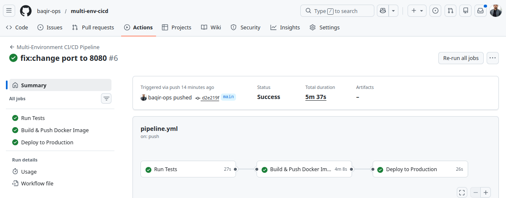
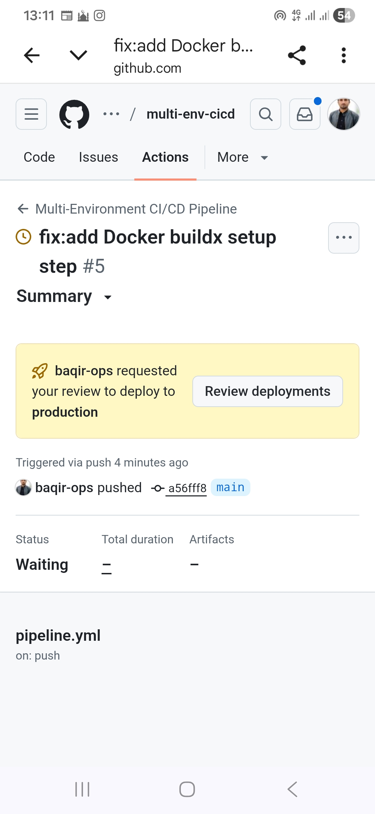
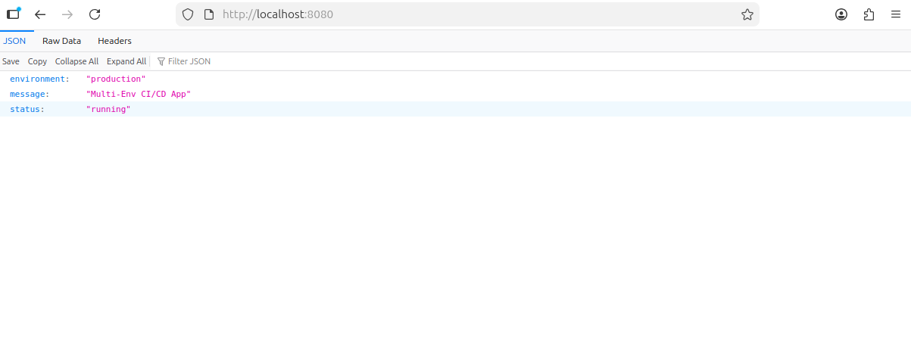
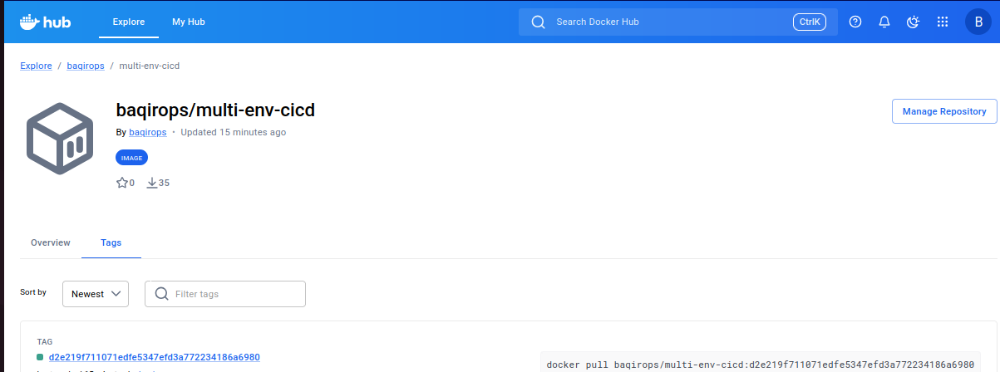
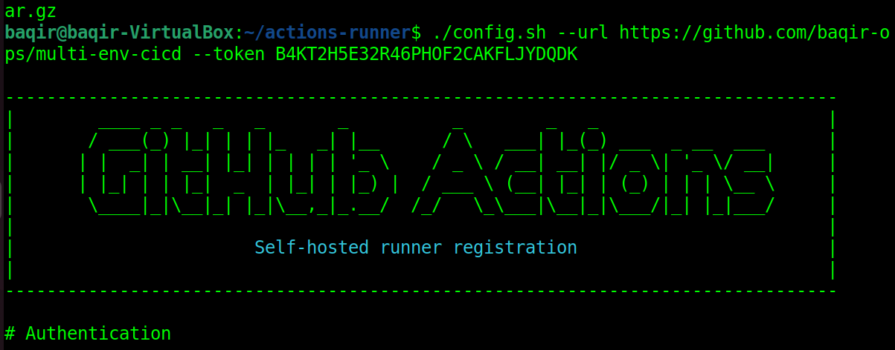

# Multi-Environment CI/CD Pipeline

A production-grade CI/CD pipeline with 3-branch GitFlow strategy,
Docker Hub integration, and a manual approval gate before production.

## Pipeline Flow
```
dev → staging → main
 ↓       ↓        ↓
Test  Build+Push  Approve+Deploy
```

## Tech Stack
- GitHub Actions (self-hosted runner on Ubuntu VM)
- Docker + Docker Hub
- Flask + pytest
- GitHub Environments with approval gate

## Branch Behavior

| Branch  | Jobs Triggered                          |
|---------|-----------------------------------------|
| dev     | Tests only                              |
| staging | Tests + Docker build + push to Hub      |
| main    | Tests + Docker push + Approve + Deploy  |

## Project Structure
```
multi-env-cicd/
├── app.py                        # Flask app
├── test_app.py                   # pytest tests
├── requirements.txt              # Dependencies
├── Dockerfile                    # Multi-stage build
└── .github/workflows/
    └── pipeline.yml              # CI/CD pipeline
```

## Screenshots

### Full Pipeline Success


### Manual Approval Gate


### App Live in Browser


### Docker Hub Image


### Self-Hosted Runner


## Live Response
```json
{
  "environment": "production",
  "message": "Multi-Env CI/CD App",
  "status": "running"
}
```

## Author
**Muhammad Baqir Nawaz**
GitHub: [@baqir-ops](https://github.com/baqir-ops)
Docker Hub: [baqirops](https://hub.docker.com/u/baqirops)
